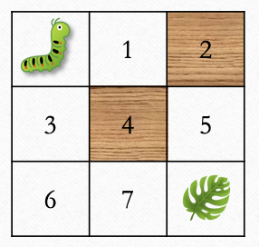

Consider the followng arrangement where some cells are blocked (there may be no way to the food!)



Write a function `can_reach_food`  which returns true if we can start at top left corner of the grid (where _bugbug_ is) and get to the bottom right corner (where the food is) while moving only one step down or right.

Note we represent the grid as a 2D array where blocked cells are indicated by `-1`and the bottom right corner is marked as `2`:
```java
int[][] maze = new int[][]{{0,1,-1},{1,-1,1},{1,1,2}};
```

@[Implement can_reach_food]({"stubs": ["src/main/java/practice/CanReachFood.java"],"command": "practice.CanReachFoodTest#test"})

