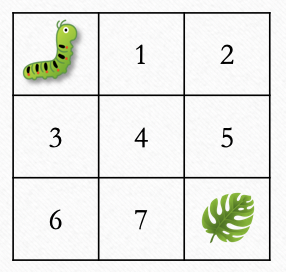

* **Goal**: count how many different paths _bugbug_ (the caterpillar) can take in order to get from the top left corner to the food (the delicious _pawpaw_ leaf) at the bottom right corner of a grid.
* **Constraint**: _bugbug_ can only move right or down.
* **Parameters**: `height` and `width` correspond the size of a rectangle grid.

@[Implement count_paths]({"stubs": ["src/main/java/practice/CountPath.java"],"command": "practice.CountPathTest#test"})