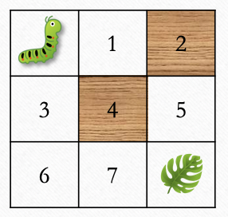

There is exactly one path from top left to bottom right corner and that is going `down`-`down`-`right`-`right`.

Write a function `find_path`  which generates a path (if one exists) from top left corner of the grid (where _bugbug_ is) to the bottom right corner (where the food is) while moving only one step down or right.
* The generated path for the above example will be `[d, d, r, r]`. 
* If there are multiple paths, return any of them. 
* If there is no path, return an empty list. 

@[Implement find_path]({"stubs": ["src/main/java/practice/FindPath.java"],"command": "practice.FindPathTest#test"})